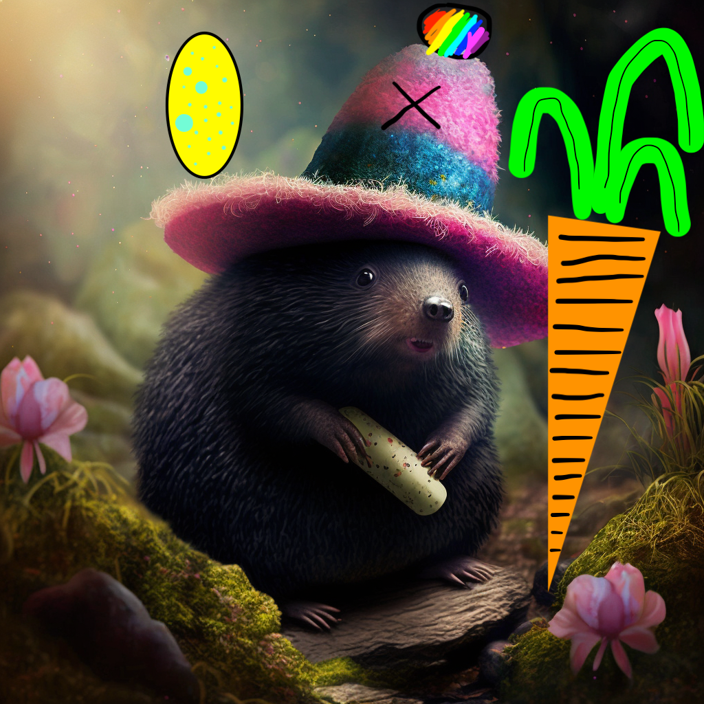

### To jest chiński kret. Konkretnie to zdjęcie pochodzi z Tajwanu.

 </img>

Zdjęcie pobrane z Wikipedii.

### A to jest chiński kret z naszej wyobraźni wspomagany Midjourney.

 </img>

Jajko dinozaura, pterodaktyla.

### To też jest chiński kret. On uwielbia się stroić :)

 </img>

Rysunek wykonany ręcznie.

**To są właśnie chińskie krety!!!**

~Coś tu jeszcze się pojawi...~
